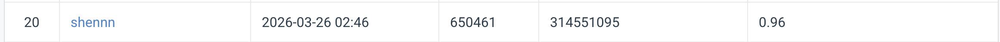

# HW1: Image Classification with Deep Learning

> **Visual Recognition — 2026**
> Student ID: `[314551095]`
> Name: `[沈蕎萱]`

---

## Introduction

This project tackles a **100-class fine-grained image classification** task as part of the Visual Recognition course (2026). The model is trained on 21,024 labelled images and evaluated on 2,344 test images via the [CodaBench](https://www.codabench.org/) competition platform.

The approach is built on **ResNet-101** (the allowed backbone) with the following key modifications and techniques:

- **GeM Pooling**: Replaces standard average pooling with learnable Generalized Mean pooling to better aggregate discriminative spatial features.
- **Custom Head**: `BatchNorm1d → Dropout(0.3) → Linear(100)` for stable fine-tuning.
- **Label Smoothing Cross-Entropy** (ε = 0.1): Prevents over-confident predictions.
- **Mixup** (α = 0.2): Interpolates training pairs to smooth decision boundaries.
- **TrivialAugmentWide + RandomErasing**: Strong data augmentation to reduce overfitting.
- **Backbone Warm-up Freezing**: Backbone frozen for the first 3 epochs to protect pre-trained weights.
- **AdamW + Cosine Annealing**: Over 60 training epochs.
- **Test-Time Augmentation (TTA)**: 3-view ensemble at inference for a consistent accuracy boost.

The final model has approximately **44.5M parameters**, well within the 100M constraint.

---

## Environment Setup

**Recommended: Python 3.9 or higher**

### Option 1 — Conda (recommended)

```bash
conda create -n hw1 python=3.10
conda activate hw1
```

### Option 2 — Virtualenv

```bash
python -m venv hw1_env
source hw1_env/bin/activate        # Linux / macOS
hw1_env\Scripts\activate           # Windows
```

### Install Dependencies

```bash
# Install PyTorch — adjust the CUDA version to match your system
# CUDA 11.8
pip install torch torchvision --index-url https://download.pytorch.org/whl/cu118

# CUDA 12.1
pip install torch torchvision --index-url https://download.pytorch.org/whl/cu121

# CPU only
pip install torch torchvision

# Other dependencies
pip install tqdm numpy pillow
```

### Verify

```bash
python -c "import torch; print(torch.__version__); print('CUDA:', torch.cuda.is_available())"
```

---

## Usage

### Dataset Structure

Download the dataset and place it under `data/` as follows:

```
data/
├── train/
│   ├── class_000/
│   │   ├── image001.jpg
│   │   └── ...
│   └── ...  (100 class folders)
├── val/
│   ├── class_000/
│   └── ...  (same structure as train)
└── test/
    ├── 00001.jpg
    ├── 00002.jpg
    └── ...  (flat directory, no subfolders)
```

### 1. Training

```bash
python train.py
```

- Trains ResNet-101 for **60 epochs** with backbone frozen for epochs 1–3
- Saves the best checkpoint to `checkpoints_resnet101_v1/best_model.pth`
- Prints `Epoch XX | Loss: X.XXXX | Val Acc: X.XXXX` each epoch

> **To log training curves**, add the following inside the epoch loop of `train.py` (after the `print` line):
> ```python
> logs.append({"epoch": epoch, "train_loss": train_loss, "val_acc": val_acc})
> with open("train_log.json", "w") as f:
>     json.dump(logs, f)
> ```
> And initialise `logs = []` before the loop.

### 2. Inference & Submission

```bash
python predict.py
```

- Loads `checkpoints_resnet101_v1/best_model.pth`
- Runs **TTA (3 views)** on all images in `data/test/`
- Saves `submission/prediction.csv`
- Packages it into `submission/submission.zip`

Upload `submission/submission.zip` to **CodaBench → My Submissions**, enter your student ID, then click **Add to Leaderboard**.

> The zip file can have any name, but the file **inside** must be named `prediction.csv`.

---

## Performance Snapshot



---